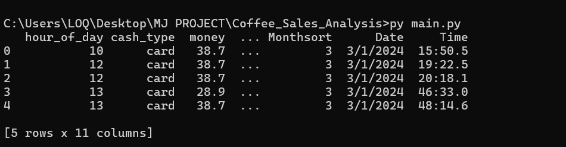
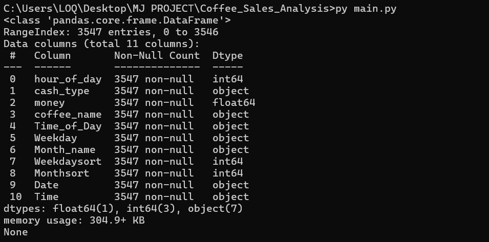
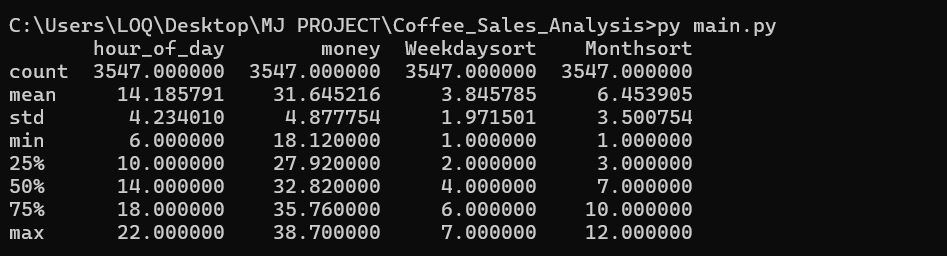
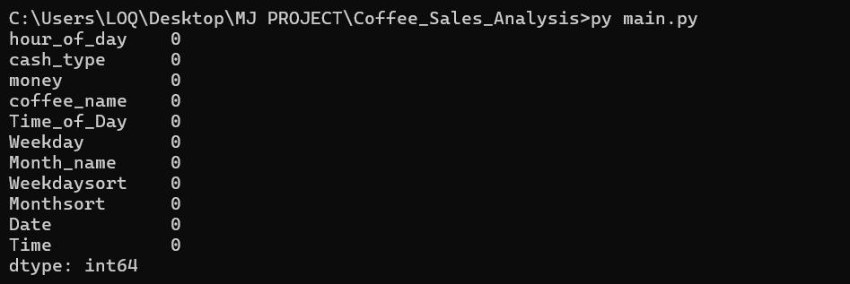

## Data Source

The dataset used in this project is from [Kaggle: Coffee Sales Dataset](https://www.kaggle.com/datasets/navjotkaushal/coffee-sales-dataset)  
License: [CC BY-SA 4.0](https://creativecommons.org/licenses/by-sa/4.0/)  
Original author: Navjot Kaushal

---

## Basic Analysis
### Preview (Screenshot)

- *It gives us a look into our 1st 5 row*

- *shows all column, data types, missing values....*

- *It gives min,max,mean....*

- *Checks if we have any missing values*
---
