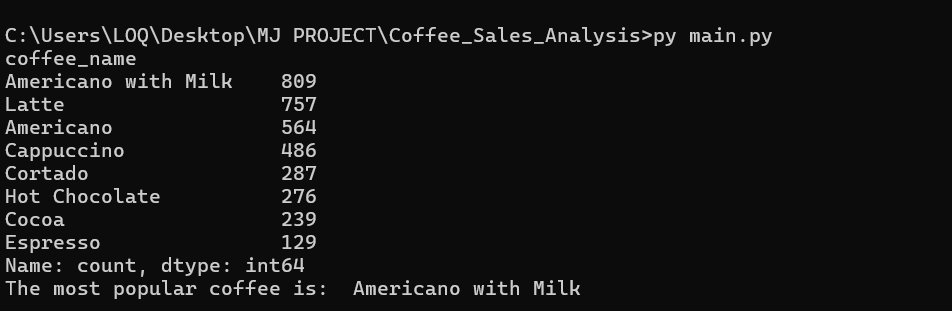
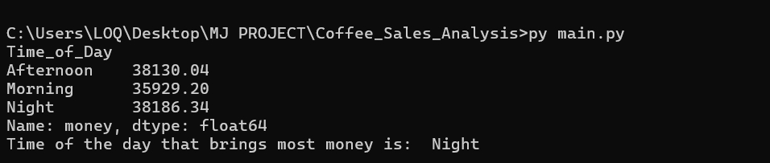
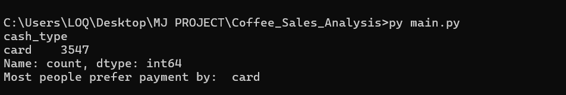
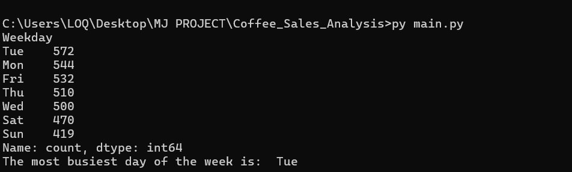
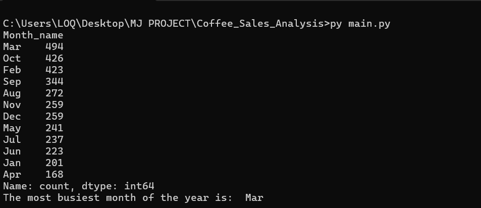
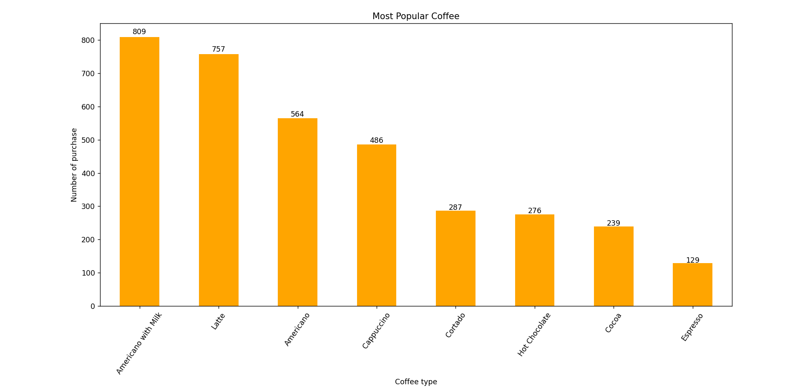
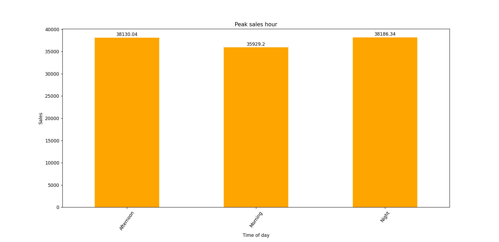
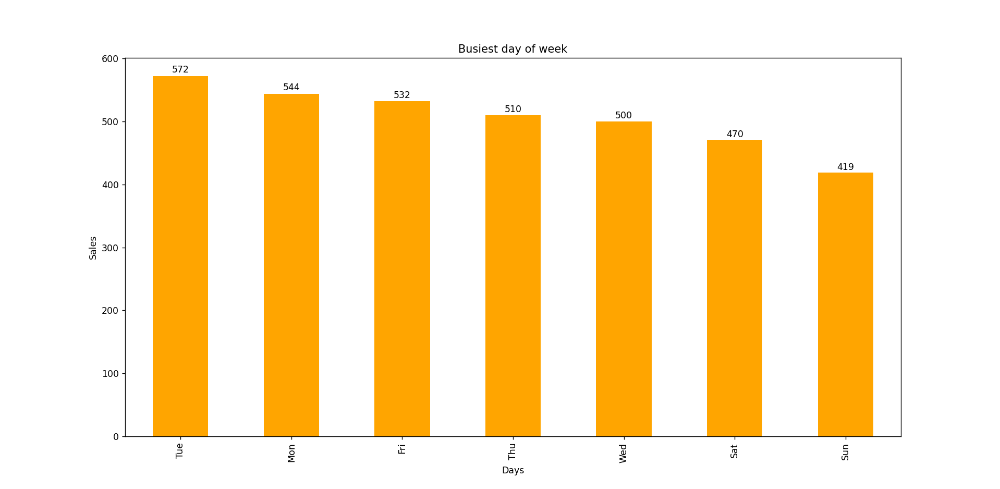
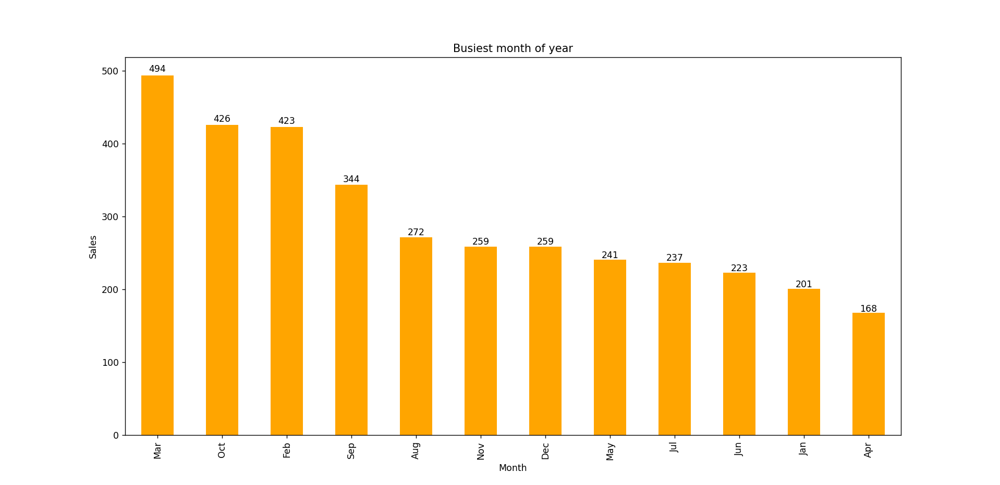

## Data Source

The dataset used in this project is from [Kaggle: Coffee Sales Dataset](https://www.kaggle.com/datasets/navjotkaushal/coffee-sales-dataset)  
License: [CC BY-SA 4.0](https://creativecommons.org/licenses/by-sa/4.0/)  
Original author: Navjot Kaushal

---

## 1. Basic Analysis
### Preview (Screenshot)

- 🔼 *It gives us a look into our 1st 5 row*
- `df.head()`

- 🔼 *shows all column, data types, missing values....*
- `df.info()`

- 🔼 *It gives min,max,mean....*
- `df.describe()`

- 🔼 *Checks if we have any missing values*
- `df.isnull().sum()`
---

## 2. Common Q/A
### Preview (Screenshot)

- 🔼 *What kind of coffee makes most sales*
- `coffee_count`

- 🔼 *What time of day makes most sales *
- `sales_by_time`

- 🔼 *What kind of payment do customer prefer*
- `prefer_payment`

- 🔼 *What day of week is the most busiest*
- `busiest_day`

- 🔼 *What month of year is most busiest*
- `busiest_year`
---

## 3. Visualization of Data Analysis
### Preview (Screenshot)

- 🔼 *What kind of coffee makes most sales*
- `coffee_count`

- 🔼 *What time of day makes most sales*
- `sales_by_time`

- 🔼 *What day of week is the most busiest*
- `busiest_day`

- 🔼 *What month of year is most busiest*
- `busiest_year`
---